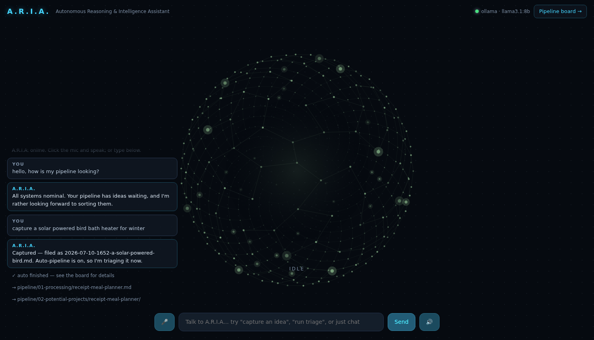
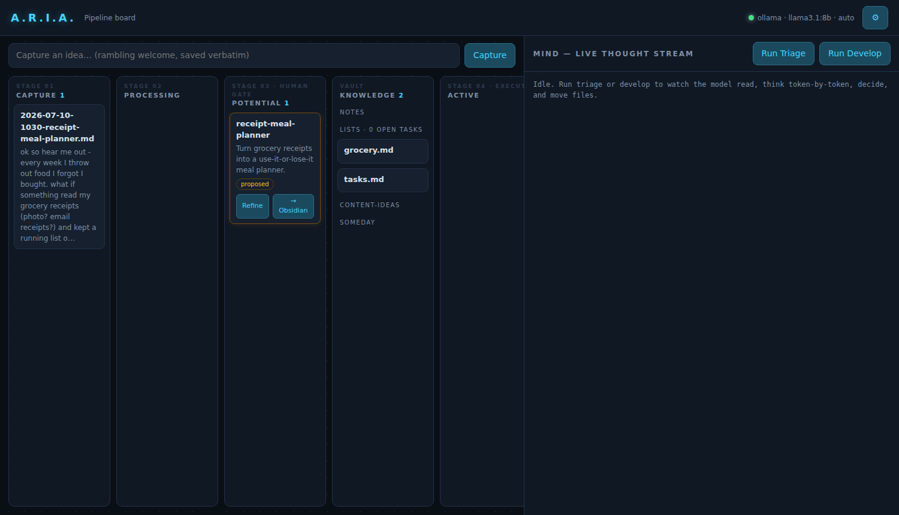
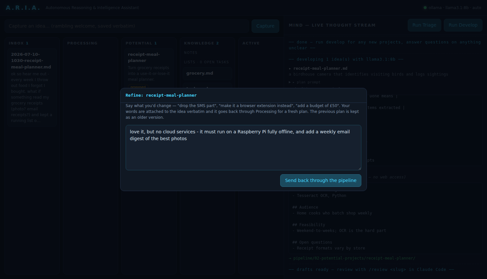

# A.R.I.A. — Autonomous Reasoning & Intelligence Assistant

A.R.I.A. turns middle-of-the-night ideas into executed projects with as little
human effort as possible. It is a **Claude Code–native pipeline**: a folder
structure (Obsidian-compatible markdown), a set of slash commands that move
ideas through the stages, subagents that do the classification / research /
planning, and a Project Manager (PM) scaffold that executes and maintains
each promoted project for its whole lifespan.

> *"I have way more project ideas than I have time to do those projects."*
> A.R.I.A. exists so the only thing you do by hand is (1) capture the idea and
> (2) review + approve the plan. Everything else is automated.

---

## The pipeline

```
  capture                triage                 develop
 ┌──────────┐  project  ┌───────────────┐      ┌────────────────────────┐
 │ 00-inbox │ ────────▶ │ 01-processing │ ───▶ │ 02-potential-projects/ │
 └──────────┘           └───────────────┘      │   <slug>/              │
      │                                        │     idea.md            │
      │ not a project                          │     research.md        │
      ▼                                        │     proposed-plan.md   │
 knowledge/                                    └────────────────────────┘
   notes/          random ideas & reference               │
   lists/          grocery items, todos          ★ HUMAN IN THE LOOP ★
   content-ideas/  "funny TikTok" material        /review  ↔  you
   someday/        not now, maybe later                   │ /approve
                                                          ▼
                                               requirements.md (approved)
                                                          │ /promote-project
                                                          ▼
                                              active-projects/<slug>/
                                                CLAUDE.md   ← the PM
                                                .claude/agents/ ← its team
                                                STATUS.md, docs/, src/
```

**The only human touchpoint** is the review/approve gate. Nothing gets
promoted or executed without an approved `requirements.md`.

## Quickstart

```bash
git clone https://github.com/coneill823/ARIA && cd ARIA
claude            # start Claude Code; it reads CLAUDE.md and becomes A.R.I.A.
```

Then drive the pipeline with slash commands:

| Command | What it does |
|---|---|
| `/capture <rambling idea>` | Drops the idea verbatim into `pipeline/00-inbox/` with frontmatter. |
| `/triage` | Classifies every inbox item (project / task / note / content / someday) and files it. Projects move to `01-processing/`. |
| `/develop [slug]` | Reads "the ramblings of a madman", researches existing tools & prior art on the web, and produces a **proposed plan** in `02-potential-projects/<slug>/`. |
| `/review <slug>` | Interactive review session: you say what you like and don't like; the plan is revised. |
| `/approve <slug>` | Converts the accepted plan into a full **requirements document** and marks it approved. |
| `/promote-project <slug>` | Moves the project out of the pipeline to the active-projects directory, scaffolds a **PM** (`CLAUDE.md`) and its project-specific **subagents**, and hands over execution. |
| `/status` | Dashboard: what's in each stage, what's stalled, full ledger. |

### Quick capture without opening Claude

```bash
bin/aria capture "app that turns my grocery receipts into a meal planner"
```

This writes the inbox note instantly (no LLM call). The other CLI verbs run
the pipeline stages headlessly, so they work from cron or any automation:

```bash
bin/aria triage           # classify the inbox
bin/aria develop          # turn processing items into proposed plans
bin/aria auto             # triage + develop in one shot (cron-friendly)
bin/aria status           # print the pipeline dashboard
bin/aria ui               # web UI: voice orb + pipeline board
bin/aria app              # open A.R.I.A. as a desktop app window
bin/aria install-desktop  # add A.R.I.A. to your application menu
bin/aria install-skills   # install Anthropic's Agent Skills for Claude Code
bin/aria doctor           # sanity-check the setup (folders, engine, models)
```

Example cron ("scheduled agent" mode — see OpenJarvis below):

```cron
# triage the inbox every morning at 7am, develop plans at 7:15
0 7 * * *  cd /path/to/aria && bin/aria triage
15 7 * * * cd /path/to/aria && bin/aria develop
```

### The visualization screen — talk to A.R.I.A.

```bash
bin/aria ui          # -> http://127.0.0.1:8700  (or: bin/aria ui 9000)
bin/aria app         # same thing in its own desktop app window
```



The main screen is A.R.I.A. herself: a wireframe network sphere of dots
that shifts state as she works — slow cyan drift when idle, green and
breathing with your mic level while listening, an amber swirl while
thinking, pulsing while speaking. Around it:

- **Voice in** — click the mic and talk (browser speech recognition;
  Chrome/Chromium works best — if the mic button is greyed out your browser
  doesn't support it, so type instead).
- **Voice out** — replies are spoken aloud via your system's speech
  synthesis; the 🔊 button mutes her.
- **Spoken commands** — "capture *(idea)*", "run triage", "develop the
  plans" are detected deterministically and actually drive the pipeline;
  anything else is open conversation with the local model, which always
  has the current pipeline state in context ("what's waiting on me?").
- **Desktop app** — `bin/aria install-desktop` puts A.R.I.A. in your app
  menu; launching starts the server if needed and opens a chromeless
  window.

### The pipeline board — watch A.R.I.A. work

The **Pipeline board →** link (or `/board`) opens the working dashboard,
styled after the stage-flow it implements: numbered stages, the human gate
highlighted, anything that needs you glowing amber.



A local dashboard (stdlib-only Python + a single HTML file, binds to
127.0.0.1, no dependencies, nothing leaves your machine):

- **Board** — live view of every pipeline stage: inbox, processing,
  potential projects (with pitch + proposed/approved badges), knowledge
  (every note and list as its own clickable card), and active projects with
  their phase. Click any card to read the underlying note.
- **Capture bar** — drop ideas straight into the inbox from the browser.
- **Mind panel** — the AI's thought process, streamed live while triage or
  develop runs: the exact prompt sent to the model (collapsible), the
  model's raw output token by token as it thinks, the decision with
  confidence bar and reasoning, and every file move. Unclear items show the
  questions the model wants answered.

The UI drives the same engine as the CLI (`bin/aria_engine.py`), so
everything it does lands in the same markdown files and ledger.

#### Auto-pipeline — idea in, plan out

With `aria.auto_pipeline: true` (the default), capturing an idea in the UI
immediately runs triage and, if it's classified a project, develop — so a
raw idea becomes a proposed plan in the Potential column without you
clicking anything. You watch the whole thing happen in the mind panel. The
`ok · auto` tag in the header confirms it's on. (The manual **Run Triage** /
**Run Develop** buttons still work, and cron users get the same in one shot
with `bin/aria auto`.)

#### Refine loop — your input sharpens the idea



Every Potential card has a **Refine** button. Type what you'd change ("drop
the SMS part", "must run fully offline", "add a £50 budget") and the idea
goes *back through the pipeline*: your feedback is appended to `idea.md`
verbatim under a `## Refinement request` heading, the current plan and
research are kept as versioned snapshots (`proposed-plan.v1.md`, …, never
deleted), the idea returns to Processing, and develop re-plans with your
feedback as binding input. The card shows a `round N` badge so you can see
how many passes it's had. Repeat until it's right.

#### Send it to Obsidian

Every Potential card also has a **→ Obsidian** button. Point
`aria.obsidian_vault` at your vault (absolute path) and it publishes the
project into `<vault>/ARIA/`: an index note with `tags: [aria, project]`, the
pitch, and wikilinks to copies of the idea, research, and plan — so it drops
straight into your second-brain graph. The card then shows an `in obsidian`
badge. This is a lightweight export; the full **approve → promote** exit
(below) still runs through Claude Code.

#### Agent Skills (anthropics/skills)

```bash
bin/aria install-skills
```

Clones [anthropics/skills](https://github.com/anthropics/skills) into
`vendor/` and links every skill into `.claude/skills/`, so **any Claude Code
session run from this repo — including the PM of every promoted project —
can use them**: document creation (docx/pdf/pptx/xlsx), frontend design,
webapp testing, MCP building, and the rest of the catalogue. Honest caveat:
skills are executed by Claude Code's agent harness; the local Ollama voice
chat can't run them — ask A.R.I.A. in a `claude` session for skill-powered
work. Re-run the installer any time to pull updates.

#### How an idea leaves Potential

There are two exits, by design:

1. **→ Obsidian** (above) — a quick publish into your second brain, for
   ideas you want to keep and cross-link but not necessarily build yet.
2. **Approve → promote** — the real build path, and the deliberate
   human gate. In a Claude Code session (`claude` from the repo root) run
   `/approve <slug>` to turn the plan into an approved `requirements.md`,
   then `/promote-project <slug>` to move it out to `active-projects/` with
   its own PM and subagent team. The UI intentionally has no one-click
   "build this" button — promotion spins up an autonomous project, so it
   stays a conscious decision you make in Claude Code.

### Engines: local Ollama vs Claude

`bin/aria triage` and `bin/aria develop` run on the engine set in
`system/config.yml → aria.engine`:

| | `ollama` (default) | `claude` |
|---|---|---|
| Runs on | your local Ollama server (e.g. `llama3.1:8b`) | headless Claude Code (`claude -p`) |
| Cost / privacy | free, nothing leaves your machine | API usage, full capability |
| Triage | ✅ works well on small models | ✅ |
| Develop | ⚠️ *draft* plan from prior knowledge — `research.md` is marked unverified (no web access) | ✅ real web research with sources |

The engines are interchangeable per run: `ARIA_ENGINE=claude bin/aria develop`
re-does a stage with full research. Slash commands inside a Claude Code
session always use Claude, and the review → approve → promote stages are
Claude Code territory either way — an 8B model is great at sorting your
inbox, not at being a project manager. `bin/aria doctor` verifies your
Ollama server and model are reachable; the local engine is implemented in
`bin/aria-ollama` (stdlib-only Python, talks to Ollama's `/api/chat`).

## Life after promotion

A promoted project is **a directory that is its own Claude Code workspace**.
Its `CLAUDE.md` is the Project Manager: it knows the requirements, maintains
`STATUS.md`, creates and delegates to project-specific subagents
(developer, researcher, market-analyst — whatever the requirements call for),
and remains your interface for the whole lifespan of the project:

```bash
cd active-projects/<slug>
claude
> begin execution          # PM works the milestone plan
> status report            # PM summarizes progress, blockers, next steps
> run analytics            # PM measures whatever the project defines as success
```

By default projects promote to `aria/active-projects/`. On your own machine,
point `system/config.yml → promotion_target` at e.g. `~/Documents/Projects`.

## Layout

```
aria/
├── CLAUDE.md                  # A.R.I.A.'s operating manual (read by Claude Code)
├── .claude/
│   ├── commands/              # the slash commands above
│   ├── agents/                # aria-triage, aria-researcher, aria-planner
│   └── settings.json
├── system/
│   ├── config.yml             # paths, categories, promotion target
│   └── templates/             # idea note, plan, requirements, PM, subagent, status
├── pipeline/
│   ├── 00-inbox/              # raw captures land here
│   ├── 01-processing/         # classified as "project", awaiting development
│   ├── 02-potential-projects/ # proposed plans awaiting YOUR review
│   ├── knowledge/             # everything that wasn't a project
│   ├── archive/               # processed inbox originals
│   └── LEDGER.md              # every idea's journey through the stages
├── active-projects/           # default promotion target (configurable)
└── bin/aria                   # capture + headless automation CLI
```

## Design notes & prior art

- **[open-jarvis/OpenJarvis](https://github.com/open-jarvis/OpenJarvis)** —
  borrowed its execution-mode taxonomy: *on-demand* agents (the slash
  commands), *scheduled* agents (`bin/aria` + cron), and *continuous* agents
  (the PM that lives with a project). Its orchestrator→specialist pattern is
  mirrored in `/promote-project`'s PM + subagent scaffold.
- **[garrytan/gbrain](https://github.com/garrytan/gbrain)** — borrowed its
  signal pipeline shape (capture → classify → enrich → background
  maintenance) and its "schema packs" idea: every note here carries typed
  YAML frontmatter so automation can route it without guessing. Its overnight
  "dream cycle" is the model for the cron examples above. If A.R.I.A.
  outgrows folders-as-database, GBrain is the natural memory backend
  (it speaks MCP, so Claude Code can plug straight into it).
- **[eugeniughelbur/obsidian-second-brain](https://github.com/eugeniughelbur/obsidian-second-brain)** —
  the closest existing implementation of this workflow (inbox triage, idea
  "graduation" into specs, scheduled vault maintenance). Worth mining for
  extra commands; A.R.I.A.'s vault stays Obsidian-compatible on purpose.
- **[VoltAgent/awesome-claude-code-subagents](https://github.com/VoltAgent/awesome-claude-code-subagents)**
  and **[wshobson/commands](https://github.com/wshobson/commands)** — pattern
  libraries the PM can raid when it designs a project's subagent team.

## Guardrails

1. Nothing is ever deleted — inbox originals are archived, not removed.
2. Nothing is promoted without `approved: true` in `requirements.md`
   frontmatter, set only by `/approve`, which runs only when *you* say so.
3. Triage never guesses on low confidence — items it can't classify are
   marked `type: unclear` with clarifying questions, and wait for you.
